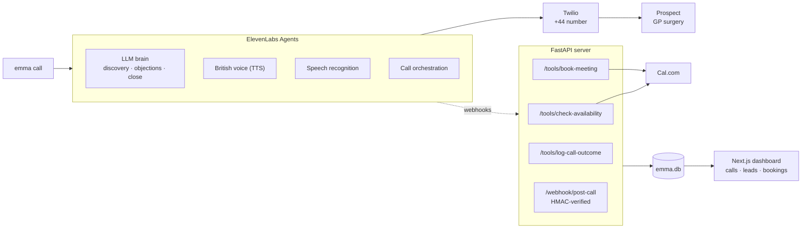
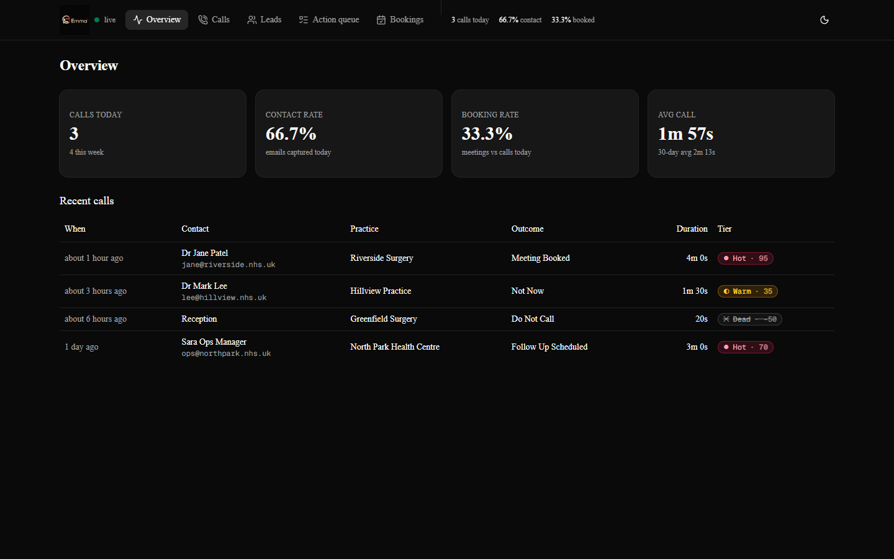
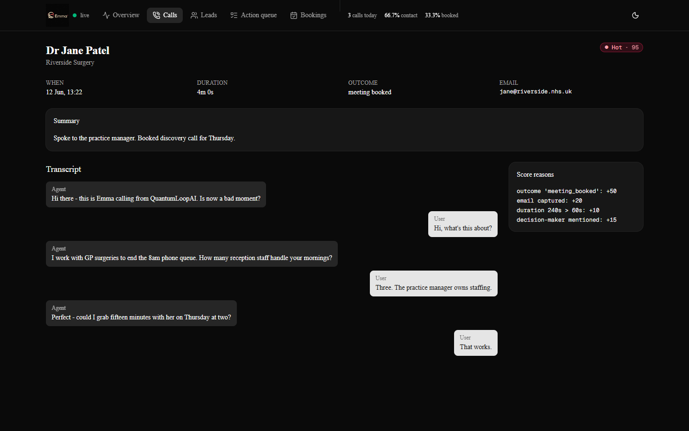
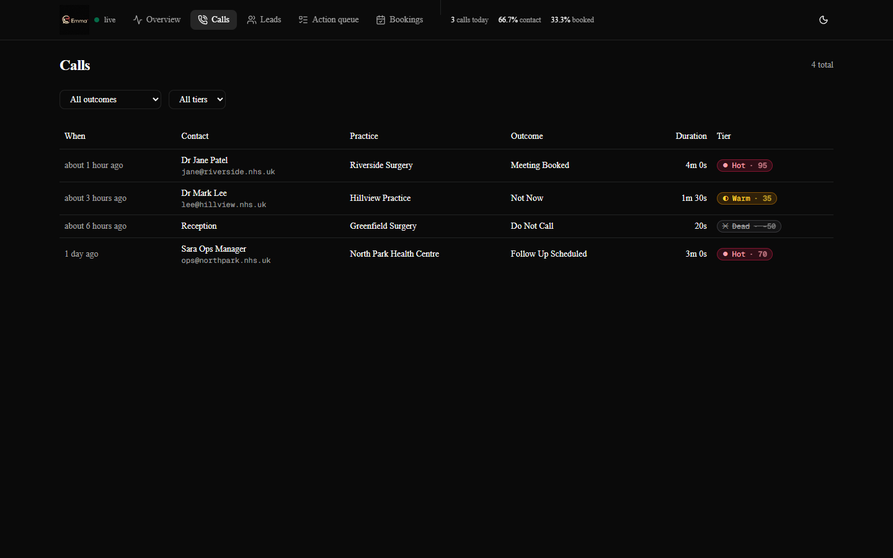
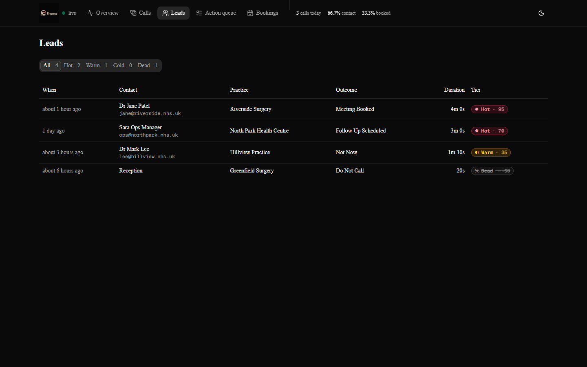

<div align="center">
  
</div>

# Emma — Outbound AI Sales Agent

> **▶ [Demo call recording](#)** — _placeholder: paste a Loom/MP4 link to a real call here._

An outbound sales-call AI agent built as a showcase for
[QuantumLoopAI](https://www.quantumloopai.com), running entirely on
**ElevenLabs Agents**.

**Stack:** Python · FastAPI · ElevenLabs Agents · Twilio · Cal.com · Next.js 16 · React 19 · Tailwind v4

[](LICENSE)

QuantumLoopAI's product **Emma** is an *inbound* AI receptionist for NHS GP
surgeries. This project flips her around: **Emma now makes outbound B2B
sales calls** — she rings UK GP practices, pitches the receptionist
product, handles every objection, and either closes a pilot or books a
meeting with the decision-maker. The meta-pitch writes itself: *Emma sells
more Emmas.*

## How it works



- **ElevenLabs Agents** is the single agent platform — it bundles the LLM
  brain, the voice, speech recognition, and the native Twilio call
  orchestration. There is no separate LLM account and no media server.
- **Twilio** contributes only the raw UK phone number. It is imported into
  ElevenLabs, which then places the calls itself.
- This FastAPI server exists only so Emma can act mid-call: look up real
  calendar slots, book the meeting, and report the outcome.

Emma's agent — prompt, voice, LLM, TTS — is built and edited in the
**ElevenLabs dashboard**. `src/emma/prompt.py` is the version-controlled
reference copy of her system prompt and verified company facts.

## Dashboard

A Next.js control room reads every call from the FastAPI backend: live
metrics, rules-based lead scoring, full transcripts, and upcoming bookings.
_(Screens below use the bundled demo seed data — no real prospects.)_

| Overview | Call transcript + scoring |
|:---:|:---:|
| [](docs/screenshots/overview.png) | [](docs/screenshots/call-detail.png) |
| **Calls** | **Leads by tier** |
| [](docs/screenshots/calls.png) | [](docs/screenshots/leads.png) |

## Prerequisites

| Account | Why | Where |
|---|---|---|
| ElevenLabs | The agent platform: brain + voice + calling | elevenlabs.io |
| Twilio | A UK (+44) phone number to call *from* | console.twilio.com |
| Cal.com | Books the meeting *(optional — see below)* | cal.com |

> **Cal.com is optional.** Without it, `check_availability` and
> `book_meeting` fall back to provisional weekday slots so the whole demo
> still runs end to end.

## Setup

The agent is built in the **ElevenLabs dashboard**. The CLI only drives
the phone side — it never creates or edits the agent.

**1. Build Emma's agent in ElevenLabs**

In the ElevenLabs dashboard, create an agent and configure:
- **System prompt** — paste the rendered prompt from `src/emma/prompt.py`
- **First message** — Emma's opener
- **Voice** — a British female voice
- **LLM** — a strong model (e.g. Claude)
- **TTS model family** — Flash (lowest latency for live calls)

Copy the agent's **ID** — you need it in step 2.

**2. Install + configure locally**

```bash
cd quantumloop-emma-outbound
python -m venv .venv && . .venv/Scripts/activate    # Windows
pip install -e .

cp .env.example .env
#   fill in: ELEVENLABS_API_KEY, ELEVENLABS_AGENT_ID (from step 1),
#   ELEVENLABS_WEBHOOK_SECRET, TWILIO_*, TARGET_TEST_NUMBER

emma status            # check what is wired up
```

**3. Import the Twilio number, then call**

```bash
emma import-number     # registers your Twilio number with ElevenLabs
emma call              # calls TARGET_TEST_NUMBER from .env
emma call +447700900123   # or pass a number explicitly
```

`import-number` saves the phone-number id to `.emma_state.json`.

**4. Cal.com tools (optional)**

For Emma to actually book meetings, run the webhook server and add three
webhook tools to the agent in the dashboard:

```bash
emma serve             # webhook server on :8000
ngrok http 8000        # public URL -> paste into SERVER_URL in .env
```

Then in the dashboard add three webhook tools pointing at
`<SERVER_URL>/tools/check-availability`, `/tools/book-meeting` and
`/tools/log-call-outcome`. Without them Emma still pitches and closes
verbally — she just cannot complete a real booking.

## The objection test

Answer the call and **keep saying "no"**. Emma is built to treat a casual
"no" as an opening, not an ending. Each refusal she:

1. acknowledges it sincerely,
2. reframes with a **fresh** angle (never repeats a line),
3. walks *down the ask ladder* — pilot → demo → 15-min call → a
   cancel-anytime calendar hold,
4. steers back toward booking the meeting.

She only stops on a **firm, explicit** refusal ("remove me", "do not call
again") or a hang-up — politeness alone is not a stop signal.

Ask her *"are you a robot?"* — she will happily confirm she is an AI and
turn that into the live demo of the product.

Watch `call_log.jsonl` while the call runs to see her tool calls and the
final outcome land in real time.

## Project structure

```
src/emma/
  config.py          settings from .env
  prompt.py          reference master of Emma's prompt + company facts
  tools.py           check_availability / book_meeting / log_call_outcome
  calcom.py          Cal.com v2 API client
  elevenlabs_client.py  ElevenLabs client: import number + outbound call
  server.py          FastAPI webhook server for the Cal.com tools
  cli.py             import-number / call / serve / status
  state.py           stores the imported phone-number id
tests/               unit tests
```

`src/emma/prompt.py` is the version-controlled reference copy of Emma's
sales playbook. The **live** prompt is the ElevenLabs dashboard agent —
edit it there, and mirror notable changes back to `prompt.py`.

## Compliance note (before calling real leads)

Test-calling your own number is fine. Calling **real UK businesses**
brings rules:

- **Ofcom** — disclose that the caller is an AI/automated system. Emma is
  prompted to confirm this honestly when asked; for live campaigns make it
  proactive.
- **TPS / CTPS** — screen numbers against the Telephone Preference
  Service registers before dialling.
- **GDPR** — have a lawful basis for the call and honour do-not-call
  requests immediately (Emma logs `do_not_call` outcomes).

This repo is a showcase. Add explicit consent and TPS screening before any
production outreach.

## Running tests

```bash
pip install -e .
pytest
```

## Built with AI-assisted development

Built solo using AI-assisted development (Claude Code): the FastAPI tool
server, the Cal.com client, the lead-scoring engine, the Next.js dashboard,
and the test suite. Emma's sales playbook in `src/emma/prompt.py` was authored
and iterated the same way. The architecture decisions, integration design, and
review were mine.

## License

MIT — see [LICENSE](LICENSE).
